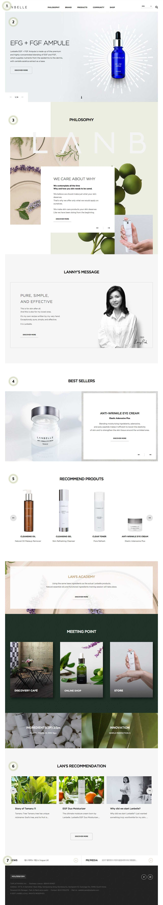
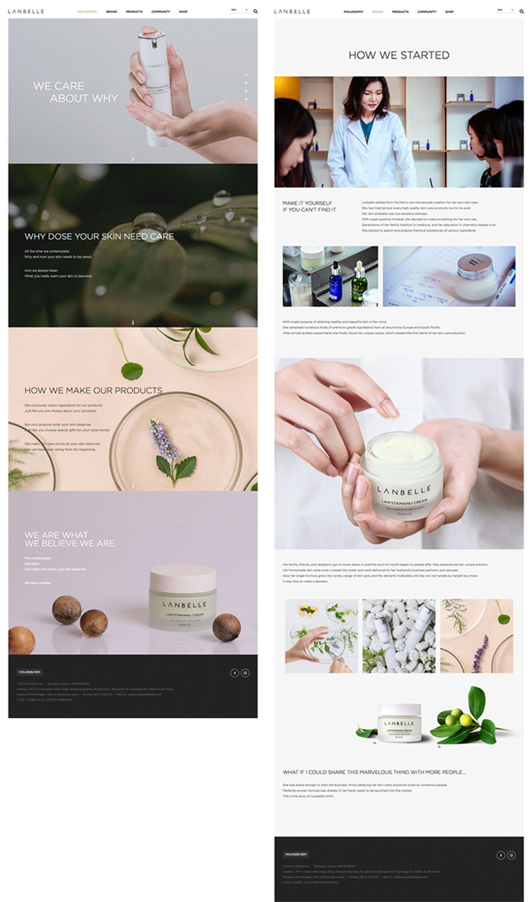
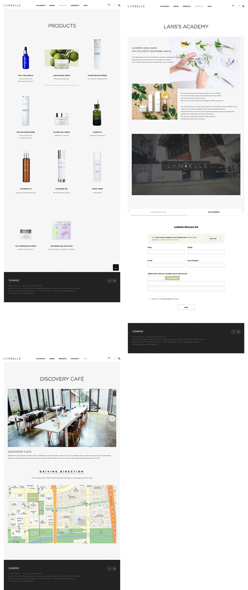

<h1>💁🏻 About This Portfolio</h1>
<br>

<p><strong><a href='http://en.lanbelle.com/?forced_lang=en'>기존에 있던 랑벨(Lanbelle)홈페이지</a> 디자인을 가이드로 하여 퍼블리싱하였습니다.</strong></p>
<br>

<blockquote><p>각각의 페이지에 따라 다양한 동적 효과를 보여주며,<br />
반응형 웹페이지를 통해 PC, Mobile에서도 자유롭게 구현하는 데 좋을 것 같아 선정하게 되었습니다.</p>
</blockquote>

<br>

<u>**Date**</u>

2020.09 ~ 2020.10

<u>**Role**</u>

마크업(100%) , 스크립트제작(100%)

<u>**Viewport**</u>

pc 1024px 이상 <br />

tablet 768px ~ 1023px 이하 <br />

mobile 768px 이하

<u>**Browsing**</u>

IE9

<u>**URL**</u>

포트폴리오👉🏻 https://jujungmin.github.io/work

블로그👉🏻 [https://jmjmjm.tistory.com](https://jmjmjm.tistory.com/)
<br>
<br>

<h2>File / Folder structure</h2>
<figure><table style="display: table;">
<thead>
<tr><th>분류 폴더</th><th>서브 폴더</th><th>파일 이름</th><th>파일 설명</th></tr></thead>
<tbody><tr><td>&nbsp;</td><td>&nbsp;</td><td>index.html<br>sub1.html<br>sub2.html<br>sub3.html<br>sub4.html<br>sub5.html</td><td>메인페이지<br>서브페이지 - philosophy<br>서브페이지 - brand<br>서브페이지 - products<br>서브페이지 - community<br>서브페이지 - shop</td></tr><tr><td>CSS</td><td>&nbsp;</td><td>reset.css<br>common.css<br>main.css<br>responsive.css<br>sub.css<br>jquery-ui.css</td><td>초기화<br>layout, header ,footer <br>메인페이지<br>common.css / main.css 반응형<br>서브페이지 / 반응형 서브페이지<br>jquery ui 스타일</td></tr><tr><td>CSS</td><td>fonts</td><td>all.css<br>font_ko.css<br>font.css</td><td>Font Awesome icon<br>notoSansKR - 한국어폰트<br>Gotham - 영어폰트</td></tr><tr><td>JS</td><td>&nbsp;</td><td>common.js<br>main.js<br>sub.js<br>jquery-3.1.0.min.js</td><td>layout, header, footer<br>메인페이지<br>서브페이지<br>jquery</td></tr><tr><td>JS</td><td>plugIn</td><td>jquery-ui.min.js<br>skoller.min.js<br>slick.min.js</td><td>&nbsp;</td></tr><tr><td>fonts</td><td>Gotham<br>NotoSansKR<br>webfonts</td><td>&nbsp;</td><td>Gotham<br>NotoSansKR<br>Font Awesome icon</td></tr><tr><td>images</td><td>common<br>main<br>sub<br>favicon</td><td>&nbsp;</td><td>header, footer 이미지<br>메인페이지 이미지<br>서브페이지 이미지<br>웹 페이지 아이콘</td></tr></tbody>
</table></figure>

<br />

<br />

## HTML / CSS / JS

- 네이밍의 첫 시작에 숫자, 특수문자, 대문자의 사용을 지양합니다.
- id는 camelCase / class는 under_score로 지정했습니다.
- id는 화면에서의 고유 기능을 명시하도록 했습니다.
- class 네이밍은 요소 기능을 나타내도록 했습니다.

<br />

#### JS naming guide

- camelCase 네이밍으로 변수 선언한 후 해당 DOM을 할당했습니다.

``` javascript
var $variableName = $('.variable_name')
```

<br />

#### HTML structure

<span style="color: #888">html에서의 공통적인 태그</span>

`skipNav` :: Skip Navigation(건너뛰기 링크) 제공. 웹 접근성에 맞춰 본문으로 포커스 이동.

`wrapper` :: header, container, footer 묶음.

⌞`header` :: 머리글에 해당하며 메뉴가 포함.

⌞`container` :: 본문에 해당.

​    ⌞ `main_head` || `sub_head` :: section의 주제.

​    ⌞`main_body` || `main_body` :: section의 내용.

​        ⌞`section` :: 본문의 단락으로 컨텐츠가 많으면 section으로 묶음.

​        ⌞`wrap` :: 자식 묶음이 너비가 필요 없을 때 컨텐츠 묶음.

​        ⌞`inner` :: 자식 묶음이 너비가 필요할 때 컨텐추 묶음 (max-width: 1200px 기준)

⌞`footer` :: 바닥글에 해당.

<br />

<br />

## Page Introduce

#### Main page

- index.html

	- 스킵 네비게이션과 tab 키를 스크립트로 제어하여 웹 접근성을 높였습니다. 

	1. 스크롤 시 header 고정. pc, mobile 화면일 때 바뀌도록 반응형에 맞게 제작했습니다.
	2. slick.js 플러그인을 활용해 텍스트가 순서대로 떠오르는 슬라이드 표현했습니다.
	3. slick.js 플러그인을 활용해 3개의 슬라이드가 움직이도록 표현했습니다.
	4. opacity 효과로 텍스트는 순서대로 떠오르는 반응형 슬라이드를 제작했습니다.
	5. 하나씩 제품이 보여지도록 반응형 롤링 슬라이드를 제작했습니다.
	6. css와 script를 같이 활용하여 반응형 슬라이드 제작했습니다.
	7. opacity 텍스트 효과 슬라이드 제작했습니다.

<br />



<br /><br />
<br />

#### sub page

<span style="color: #888">왼쪽부터 오른쪽으로 보는 순서입니다.</span>

- **sub1.html**
	- 반응형에도 스크롤 이벤트가 작동하도록 페이지를 제작했습니다.
- **sub2.html**
	- skllor.js 플러그인을 사용하여 스크롤에 따라 이미지가 확대・축소효과를 주었습니다.
- **sub3.html**
	- css `linear-gradient`를 사용하여 hover 시 백그라운드 배경이 자연스럽게 나오도록 표현했습니다.
- **sub4.html**
	- 사용자 정보 작성을 위한 form을 정규표현식을 사용해 제작했습니다.
	- form 작성 할 때 규격에 맞지 않으면 오류박스가 나오도록 스크립트를 만들었습니다.
- **sub5.html**
	- 반응형 rolling 슬라이드를 직접 제작하였습니다.
	- kakao map API를 사용하여 위치를 나타내었습니다.





<br />
<br />
<br />

### 작업 후,
콘텐츠들이 많이 있는 디자인 시안을 선택해 다양하고, 재미있게 코드를 짤 수 있을 것 같아 선정하게 되었습니다.

포트폴리오를 만들기 전 저의 목표는 '처음부터 끝까지 내 손으로 짜보자.' 였습니다.

**배웠던 점**

먼저 하나의 프로젝트처럼 통일감을 주기 위해 이름을 구조화하여 이름을 지었습니다.

메인페이지와 서브페이지의 공통적인 부분을 묶어 반응형 할 때 CSS를 간결하게 하여 코드를 최소화했습니다. 아직 스크립트 부분이 많이 부족하지만, 작업하면서 기록해놓고, 이해가 되지 않는 부분은 코드를 직접 써서 이해하도록 노력했습니다.

포트폴리오를 시작하고 구조를 짤 때 스크립트까지 깊게 생각하지 못했던 점이 아쉬웠습니다. 이로 인해 HTML의 구조를 바꿔야 하는 상황이 와서 CSS도 꼬였던 일이 많았습니다. 다음부터는 정확하게 무슨 스크립트를 구상할 것인지 어떻게 짤 것인지 생각하며 짜야겠다는 생각이 들었습니다.

또한, 반응형 슬라이드를 만들 때 고정적인 너비가 아니라 유동적인 너비를 만들어야 해서, 이미지와 스크립트와 같이 적용하니 원하는 화면이 나오지 않아 애를 많이 먹었습니다. 많이 검색해보고 찾아본 결과, 애니메이션을 적용할 때 CSS와 jQuery의 적절한 매치를 하는 방법을 찾을 수 있었습니다.

**앞으로**

작업하면서 내가 알았다고 생각했던 점들이 많이 부족하다고 반성하는 시간이었고, 다시 개념을 다질 수 있었던 계기였습니다. 그러면서도 하나하나 알아가는 재미를 느꼈고, 어떻게 하면 더 나은 방향으로 갈 수 있는지에 대해 고민해 볼 수 있는 시간을 가져서 보람있게 작업해서 나아갔습니다.

퍼블리싱을 하면서 콘텐츠를 보여줄 수 있는 다양한 방법들과 더 나은 표준성을 위해 계속 배워나가야겠다는 생각이 들었습니다.

감사합니다.

<br />
<br />
<br />