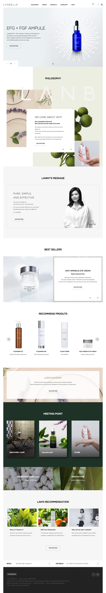

# 💁🏻 About This Portfolio

**[기존에 있던 랑벨(Lanbelle)홈페이지](http://en.lanbelle.com/?forced_lang=en) 디자인을 가이드로 하여 퍼블리싱하였습니다.**

>각각의 페이지에 따라 다양한 동적 효과를 보여주며,
>반응형 웹페이지를 통해 PC, Mobile에서도 자유롭게 구현하는 데 좋을 것 같아 선정하게 되었습니다.

**Date**								2020.09 ~ 2020.10

**Role**			 					마크업(100%) , 스크립트제작(100%)

**Viewport**						반응형

**Cross Browsing**			크로스브라우징

**URL**								  포트폴리오👉🏻	https://jujungmin.github.io/work

​									  	블로그	  👉🏻	https://jmjmjm.tistory.com

2020.09.01 ~ 2020.10.25 디자인가이드작업+섹션분리(2), 코드작업(3), 스크립트짜기(2),

## File / folder structure

| 분류 폴더 | 서브 폴더                              | 파일 이름                                                    | 파일 설명                                                    |
| --------- | -------------------------------------- | ------------------------------------------------------------ | ------------------------------------------------------------ |
|           |                                        | index.html sub1.html sub2.html sub3.html sub4.html sub5.html | 메인페이지 서브페이지 - philosophy 서브페이지 - brand 서브페이지 - products 서브페이지 - community 서브페이지 - shop |
| CSS       |                                        | reset.css common.css main.css responsive.css sub.css jquery-ui.css | 초기화 layout, header ,footer  메인페이지 common.css / main.css 반응형 서브페이지 / 반응형 서브페이지 jquery ui 스타일 |
| CSS       | fonts                                  | all.css font_ko.css font.css                       | Font Awesome icon notoSansKR - 한국어폰트 Gotham - 영어폰트 |
| JS        |                                        | common.js main.js sub.js jquery-3.1.0.min.js  | layout, header, footer 메인페이지 서브페이지 jquery |
| JS        | plugIn                                 | jquery-ui.min.js skoller.min.js slick.min.js       |                                                              |
| fonts     | Gotham NotoSansKR webfonts   |                                                              | Gotham NotoSansKR Font Awesome icon                |
| images    | common main sub favicon |                                                              | header, footer 이미지 메인페이지 이미지 서브페이지 이미지 웹 페이지 아이콘 |

## HTML/CSS naming

- id / class 명

  - naming의 첫 시작에 숫자, 특수문자, 대문자의 사용은 지양한다.
  - id는 문서 내에서 한 번만 사용가능하며, id와 class 명은 같지 않도록 한다.
  - id는 `camelCase`로 작성한다.

  - class는 `under_score`로 작성하여 `형태_의미_상태` 순서로 조합하여, 3단계를 넘어가지 않는다.

## Page Introduce

- `메인페이지` index.html
  - 슬라이드 제작 및 슬라이드 플러그인(slick) 활용했습니다.

- `서브페이지` sub1.html
  - 스크롤 이벤트 제작, 원페이지 레이아웃을 작업했습니다.

- `서브페이지` sub2.html
  - skllor.js plugin을 사용하여 스크롤에 따라 이미지가 확대・축소됩니다.

- `서브페이지` sub3.html
  - CSS `linear-gradient` 사용해 hover 시 투명도를 표현했습니다.

- `서브페이지` sub4.html 
  - 사용자 정보 작성을 위한 form을 제작했습니다.

- `서브페이지` sub5.html
  - kakao map API를 사용하여 위치를 나타내었습니다.

- **반응형 사이즈**

> pc size 1024이상~
>
> tablet size 768px 이상 1023px 이하
>
> mobile size 767px 이하~

## Layer structure

| 약속어     | 범위                                    |
| ---------- | --------------------------------------- |
| #wrapper   | 페이지 전체 영역                        |
| #header    | 머리글 영역                             |
| #container | 본문 영역                               |
| #section   | 주요 콘텐츠 영역                        |
| #footer    | 바닥글 영역                             |
| .wrap      | 고정너비가 필요없을 때 콘텐츠 묶음 영역 |
| .inner     | 고정너비가 필요할 때 콘텐츠 묶음 영역   |

## Main page

## Sub page

---

### 작업 이후,

콘텐츠들이 많이 있는 디자인 시안을 선택해 다양하고, 재미있게 코드를 짤 수 있을 것 같아 선정하게 되었습니다.

포트폴리오를 만들기 전 저의 목표는 '처음부터 끝까지 내 손으로 짜보자.' 였습니다.

**배웠던 점**

먼저 하나의 프로젝트처럼 통일감을 주기 위해 이름을 구조화하여 이름을 지었습니다.
메인페이지와 서브페이지의 공통적인 부분을 묶어 반응형 할 때 CSS를 간결하게 하여 코드를 최소화했습니다.
아직 스크립트 부분이 많이 부족하지만, 작업하면서 기록해놓고, 이해가 되지 않는 부분은 코드를 직접 써서 이해하도록 노력했습니다.

포트폴리오를 시작하고 구조를 짤 때 스크립트까지 깊게 생각하지 못했던 점이 아쉬웠습니다. 이로 인해 HTML의 구조를 바꿔야 하는 상황이 와서 CSS도 꼬였던 일이 많았습니다.
다음부터는 정확하게 무슨 스크립트를 구상할 것인지 어떻게 짤 것인지 생각하며 짜야겠다는 생각이 들었습니다.

또한, 반응형 슬라이드를 만들 때 고정적인 너비가 아니라 유동적인 너비를 만들어야 해서, 이미지와 스크립트와 같이 적용하니 원하는 화면이 나오지 않아 애를 많이 먹었습니다.

많이 검색해보고 찾아본 결과, 애니메이션을 적용할 때 CSS와 jQuery의 적절한 매치를 하는 방법을 찾을 수 있었습니다.

**앞으로**

작업하면서 내가 알았다고 생각했던 점들이 많이 부족하다고 반성하는 시간이었고, 다시 개념을 다질 수 있었던 계기였습니다.

그러면서도 하나하나 알아가는 재미를 느꼈고, 어떻게 하면 더 나은 방향으로 갈 수 있는지에 대해 고민해 볼 수 있는 시간을 가져서 보람있게 작업해서 나아갔습니다.

퍼블리싱을 하면서 콘텐츠를 보여줄 수 있는 다양한 방법들과 더 나은 표준성을 위해 계속 배워나가야겠다는 생각이 들었습니다.

